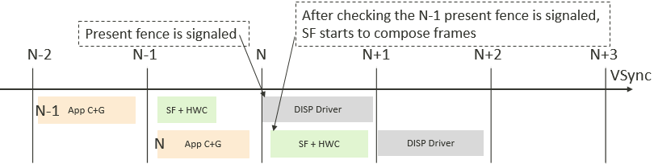
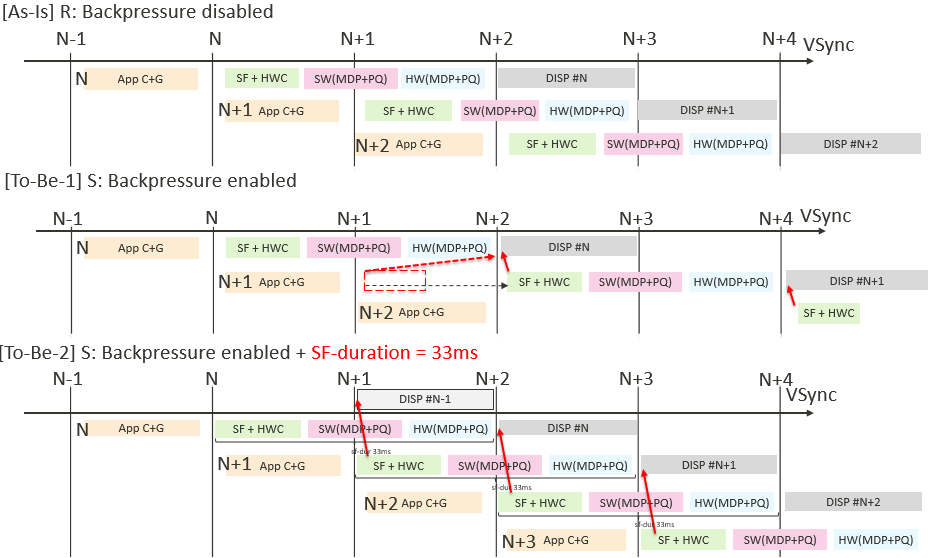

# .config
- userdebug吃的是arch/arm64/configs/k6853v1_64_defconfig
- eng吃的是arch/arm64/configs/k6853v1_64_debug_defconfig
- 所以在修bug时一定要先确认一下该修的是什么版本上的问题

# Present fence

- VSync就是mtk_dsi.c中的mtk_dsi_irq_status()->wake_up_interruptible(&mtk_crtc->present_fence_wq);产生的
- dsi产生的VSync会喂给所有上层HWC/SF/APP
- Present fence signaled和fence release都是在mtk_disp_rdma.c->mtk_disp_rdma_irq_handler->wake_up_interruptible(&mtk_crtc->present_fence_wq);sf是吃wake_up_interruptible(&mtk_crtc->sf_present_fence_wq);这个
- APP C+G：在N-2帧的位置，APP通过CPU或GPU绘制第(N-1)帧
- SF+HWC：SF和HWC开始处理第N-1帧，此时APP开始通过CPU或GPU绘制第N帧
- DISP Driver：
    - buf送到了RDMA(目前认为这是frame start时间点)，也就是准备送显第N-1帧，DISP会发Present fence signaled
    - 当SF收到第N帧的Vsync时会检测第N-1的Present fence signaled，如果产生了signaled，SF和HWC才会开始处理第N帧
    - VSync由HW发起，是从DISP到HWC再到SF，所以HW不管上层什么时间、以什么方式送，HW只管拿到就送显相对单纯一些
    - 这里的送显，并不一定显示出来，只是交给了DSI
- 这是理想情况下的flow，也就是SF+HWC每次都能在1帧的时间内处理完成
- 如果SF+HWC一帧处理不完，DISP就不能送显，下一帧APP画的SF+HWC处理就会delay，也就是整体delay导致丢帧，就需要下面Backpressure的处理flow
# Backpressure

- 在R上Backpressure disabled
    - SF+HWC,SW(MDP+PQ),HW(MDP+PQ)的处理时间可能比较长，假设需要两帧时间
    - 软件和硬件的MDP+PQ有什么区别？
    - APP C+G绘制的第N帧需要经过两帧的处理才到达DISP(DISP driver)
    - DISP #N表示送显第N帧
    - 不管DISP是否发送Present fence signaled，上层SF+HWC,SW(MDP+PQ),HW(MDP+PQ)都开始处理一下帧，或者说APP绘完就开始处理，也就是上层SF+HWC,SW(MDP+PQ),HW(MDP+PQ)可能同时在处理两帧
    - 这样做的问题是，如果SF+HWC,SW(MDP+PQ),HW(MDP+PQ)的处理时间超过两帧就会出现丢帧情况，或出现DISP帧堆积
    - 丢帧是怎么发生的，是因为上层SF+HWC,SW(MDP+PQ),HW(MDP+PQ)不能同时处理3帧吗？
- 在S上Backpressure enabled
    - 上层SF+HWC,SW(MDP+PQ),HW(MDP+PQ)在处理下一帧时需要等到DISP发送的Present fence signaled才开始
    - 这样做的问题，可能导致APP绘制的图像，在上层SF+HWC,SW(MDP+PQ),HW(MDP+PQ)处理时丢帧
- 在S上Backpressure enabled的基础上再加上SF-duration = 33ms
    - 之前采用app+offset或SF+offset的方式，现在改成了duration与offset可以互相转换
    - SF-duration就是规定了一个处理时长，比如不管APP或DISP处理多久，SF都只能处理33ms(60Hz下两帧)
    - 一般设置APP-duratoin=20ms，SF-duration = 27.6ms(>16.6处理的就是1帧)
    - 上层SF+HWC,SW(MDP+PQ),HW(MDP+PQ)在处理下一帧时需要等到DISP发送的Present fence signaled才开始
    - DISP #N表示送显第N帧时，DISP放掉Present fence，DISP开始调用CMDQ送显上一帧，锁定当前帧
- Backpressure机制整体上是在限制上层，不再限制DISP底层，防止帧堆积
- 引入SF-duration机制是在保障能够出帧均韵
